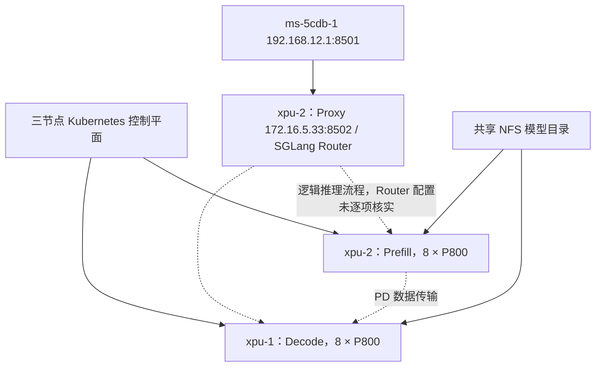

# XPU 环境与部署架构记录

> 本文保留 2026-09-21 的采集记录。2026-09-23 已重新核实并修正角色为 XPU-1 Prefill、XPU-2 Decode，当前映射及核验边界见 [XPU 角色及缓存监控修复](xpu-role-fix-20260923.md)。

采集日期：2026-09-21。通过 SSH MCP 只读采集，两台均以 root 连接成功。xpu-2 初次主机密钥校验失败，本次重试成功，未绕过校验。未修改远程配置，未在服务器上新增目录。

## 节点环境

| 项目 | xpu-1 | xpu-2 |
| --- | --- | --- |
| 用户约定角色 | master | 第二节点 |
| 实际 Kubernetes 角色 | 工作节点，Ready | 工作节点，Ready |
| 推理角色 | Decode | Prefill + Router |
| 主机名 | tcs-122-209-21-33 | tcs-122-209-21-34 |
| 管理 IP | 122.209.21.33/24 | 122.209.21.34/24 |
| 系统 | Kylin Linux Advanced Server V10 (Halberd) | 同左 |
| 内核 | 4.19.90-89.40.v2401.ky10.x86_64 | 同左 |
| CPU | Hygon C86-4G 7490，2 插槽 × 64 核，256 逻辑 CPU | 同型号，lscpu 报告 255 逻辑 CPU |
| NUMA | 8 节点 | 8 节点 |
| 内存 | 2.2 TiB，已用 66 GiB，可用 2.1 TiB | 2.2 TiB，已用 531 GiB，可用 1.7 TiB |
| Swap | 无 | 无 |
| 加速卡 | 8 × P800 OAM，每卡 96 GiB | 同左 |
| 驱动 / XPU-RT | 5.0.21.47 / 5.0.21 | 同左 |
| Kubernetes | v1.32.2-8ee4bc01 | 同左 |
| 集群报告运行时 | containerd://1.7.27-82-ge5a462d3b | 同左 |

xpu-2 的 CPU online/present 为 0-254、offline 为 255；lscpu 报告每核线程数 1，与其他拓扑数值存在不一致，原因未核实。

xpu-2 PATH 命中 /usr/local/bin/containerd，版本为 1.6.28；systemd 实际启动 /usr/bin/containerd，集群报告版本为 1.7.27-82-ge5a462d3b。运维时需区分。

## 存储和网络

| 挂载点 | 类型 | xpu-1 容量 / 已用 / 可用 / 使用率 | xpu-2 容量 / 已用 / 可用 / 使用率 |
| --- | --- | --- | --- |
| / | xfs | 392G / 66G / 326G / 17% | 392G / 61G / 332G / 16% |
| /data | xfs | 3.5T / 392G / 3.2T / 11% | 3.5T / 206G / 3.3T / 6% |
| /data1 | ext4 | 3.5T / 2.9T / 390G / 89% | 3.5T / 2.3T / 992G / 71% |
| /ssd1 | ext4 | 3.5T / 2.1T / 1.2T / 64% | 3.5T / 1.9T / 1.5T / 56% |

共享 NFS：NAS-WQ2.SDC.CS.ICBC:/ai-cloud-nas，4.9T，已用 1.3T，可用 3.7T，27%；基础挂载点 /mnt/unifiedcsi/nfs/csi-dfs-ti-platform-fs。

模型目录：/ai-cloud-nas/tione/ti-template-server/llm_internal/model/GLM-5.2-W4A8-taco-xpu，容器内挂载 /data/model。预训练模型目录挂载 /opt/ml/pretrain_model，另有 codekit 和 /dev/shm 挂载。

| 网卡 | xpu-1 | xpu-2 |
| --- | --- | --- |
| p10p1 | 122.209.21.33/24 | 122.209.21.34/24 |
| xgbe0 | 172.10.2.2/24 | 172.10.2.5/24 |
| xgbe1 | 172.10.1.2/24 | 172.10.1.5/24 |
| xgbe2 | 172.10.4.2/24 | 172.10.4.5/24 |
| xgbe3 | 172.10.3.2/24 | 172.10.3.5/24 |
| cilium.ipip | 172.16.3.0/32 | 172.16.5.0/32 |

## 集群和部署架构

集群共 5 个 Ready 节点。Kubernetes 控制平面/master 为 122.47.154.143、122.47.154.15、122.47.154.75。两台 XPU 的 ROLES 均为 none。因此保留用户对 xpu-1 的 master 称呼，但其实际 Kubernetes 角色是工作节点，推理角色是 Decode。

命名空间 ns-1，服务 ms-5cdb-1，采用 SGLang Prefill/Decode 分离。三个组件分别由同名 StatefulSet（去除 Pod 末尾 -0）管理，每个 Pod 包含 main 和 sidecar-nginx。

| Pod | 节点 / Pod IP | 网络 | main 请求和上限 | 状态 |
| --- | --- | --- | --- | --- |
| ms-5cdb-1-decode-0 | xpu-1 / 122.209.21.33 | hostNetwork | 220 CPU、1 TiB、8 XPU、1 RDMA HCA | 2/2 Running，0 重启 |
| ms-5cdb-1-prefill-0 | xpu-2 / 122.209.21.34 | hostNetwork | 200 CPU、1 TiB、8 XPU、1 RDMA HCA | 2/2 Running，0 重启 |
| ms-5cdb-1-proxy-0 | xpu-2 / 172.16.5.33 | Pod 网络 | 8 CPU、16 GiB | 2/2 Running，0 重启 |

主镜像：registry.tce.com/ti-platform/llm-infer-w4a8-xpu:sglang_p800_glm5_int8-2026-07-30-15-09-db12744-ti0811

sidecar 镜像：registry.tce.com/ti-ems-server/openresty:openresty_feature_private_3.12.0-patch01_ee09f77_260716

### 入口和数据路径

- ms-5cdb-1：ClusterIP 192.168.12.1:8501 → proxy Pod 172.16.5.33:8502；指标端口 9092 → 9092。
- proxy main 进程名为 sglang::router；sidecar 内部转发配置未读取。
- ms-5cdb：ClusterIP 192.168.13.145:8501，Endpoints 同时包含 122.209.21.33:8501、122.209.21.34:8501、172.16.5.33:8501，不能直接当成 Router 专用入口。
- 两端推理进程均监听 0.0.0.0:8501。
- 未发现 ns-1 模型专用 Ingress；平台 Ingress 地址为 122.47.154.160。外部调用网关路径与认证尚未核实。

### 实际进程参数摘要

共同参数：served-model-name=glm-5.2，model-path=/data/model，quantization=w4a8_int4，TP=8，EP=8，context-length=204800，page-size=64，KV cache=int8；attention-backend=nsa，prefill/decode attention backend=klxdsa；NEXTN 3 steps、topk=1、4 draft tokens；开启 DP attention 和 DP LM head。

| 参数 | Decode / xpu-1 | Prefill / xpu-2 |
| --- | --- | --- |
| disaggregation-mode | decode | prefill |
| dp-size | 8 | 未显式指定 |
| max-running-requests | 64 | 16 |
| mem-fraction-static | 0.88 | 0.80 |
| chunked-prefill-size / max-prefill-tokens | 32768 / 32768 | 32768 / 32768 |
| DeepEP mode | low_latency | normal |
| 缓存 | disable-radix-cache | hierarchical cache，ratio=32，write_through |
| CUDA graph 参数 | max-bs=8，bs=1..8 | disable-cuda-graph |
| transfer backend | 显式 mooncake | 未显式指定 |

两端 disaggregation-ib-device：mlx5_3,mlx5_3,mlx5_0,mlx5_0,mlx5_5,mlx5_5,mlx5_4,mlx5_4；NUMA 参数为 3 3 2 2 7 7 4 4。以上是启动参数，未进行 RDMA 或数据传输测试。

基础组件包括 cilium-router、tcs-cni、ipamd、kube-proxy、CoreDNS、XPU device plugin/exporter、Unified CSI、NFS CSI、node exporter 和日志采集。

## 异常与核验边界

- 两台各有一个 csi-nfs-ti-flex-nas-2090478420952613653-jdrhqsrbx8-* Pod 处于 CrashLoopBackOff，重启约 2745/2743 次。另一组 csi-nfs-csi-dfs-ti-platform-fs 正常运行，模型 NFS 已挂载。故障影响范围及原因未调查。
- xpu-1 /data1 使用率 89%。
- XPU 显存高度占用：xpu-1 每卡约 94238–94294 MiB；xpu-2 每卡约 92718–98148 MiB，卡 5 为 98148/98304 MiB。采集时所有卡不可纠正 ECC 计数为 0。
- xpu-2 CPU 枚举及 containerd PATH 版本差异见上文。
- 本次没有发推理请求，Running/Ready 不等于已验证端到端服务；尚未核实 Router 后端配置、外部网关、框架精确版本和业务性能。

依据：SSH MCP 系统信息、XPU-SMI、systemctl、kubectl 节点/Pod/Service/Endpoints/Ingress、筛选后的容器元数据、推理进程参数及 Router 容器只读进程查询。未采集 Secret 或 kubeconfig 内容。没有进行新部署或自动修复。

## 2026-09-21 Gateway 部署完成

已新增独立 ai-gate/aigate，固定 xpu-1，hostNetwork 显式绑定 122.209.21.33:30002；对外 Base URL 为 http://122.209.21.33:30002/v1，模型 glm-5.2，直接连接 ms-5cdb-1.ns-1.svc.cluster.local:8501。画像接口 122.209.21.33:18082 使用独立 Secret，管理为 Unix socket。完整配置、服务器新增目录、重启修复与验收证据见 [XPU 网关部署记录](../../aigate/deploy/xpu/README.md)。此前“未新增目录”的说明仅适用于最初环境采集。

最终验收：节点及 A3-gate 的 JSON/SSE、工具调用及续答通过；重启保留 166 项累计指标/统计起点；三个推理 Pod 未重启，A3 路由保持 a3/15。
